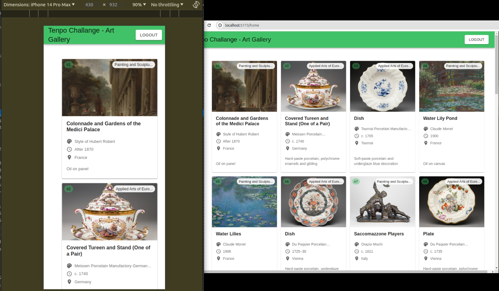
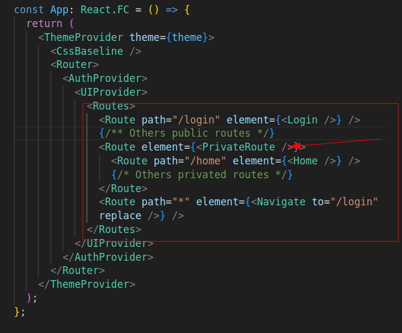
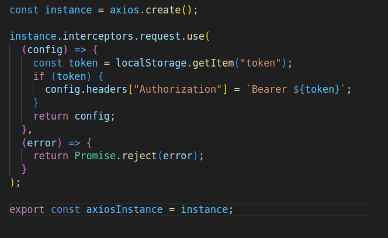
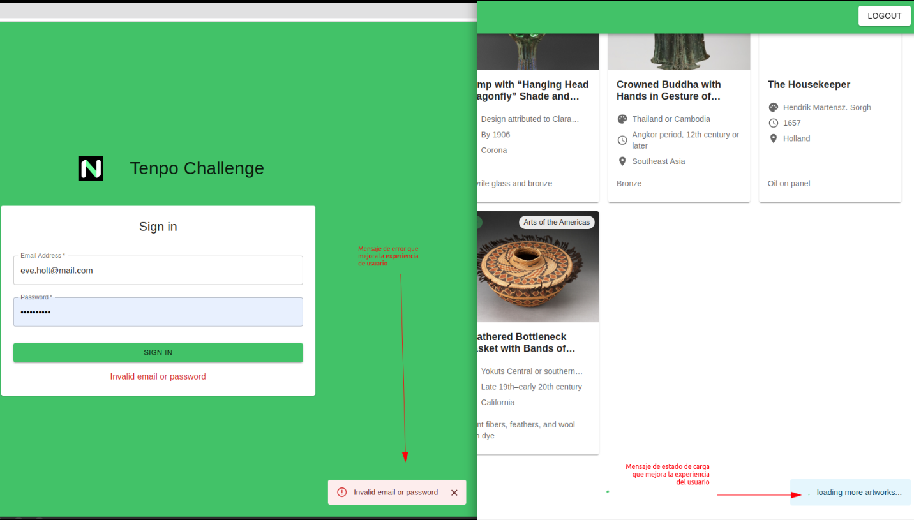

# Challenge

Se requiere crear una aplicación en un repositorio personal que haga lo siguiente:
- Levante una pantalla de login (correo y pass) y haga un fake-login (código 200-OK +
token-fake).
- Levantar una home, la cual se conecte con una API pública (a elección) y muestre
una lista de 2000 elementos.
- Mostrar un botón de logout que te devuelva al login y limpie la sesión.

## Requisitos sobre la solución:

- Desarrollar una app en react con typescript que sea responsiva (web y mobile).
- El manejo de estilos o uso de librerías CSS es a elección.
- Readme con los pasos para correr el proyecto y documentación necesaria.
- Almacenar token en memoria, seleccionar la forma/herramienta/librería que se crea
más conveniente para este propósito (persistencia de token).
- Definir el diseño/arquitectura que creas más conveniente para tener un contex
público (login) y privado (home) que luego te permita crecer en el tiempo con
nuevos módulos. Ej: módulo de cambio de contraseña (público) ó módulo de datos
del usuario (privado).
- Usar axios para el fetching y configurarlo para enviar el token-fake en las requestmás allá de que no se use.
- Definir la mejor forma bajo su criterio para mostrar la lista de la home
argumentando en unas pocas líneas su solución.
- Defina una estrategia de logout que haga sentido con el diseño de context
público/privado.
- Proponer una mejora teórica sobre las llamadas usadas al backend para que
nuestra app sea más eficiente.

# Solución

Se desarrolló una aplicación en React con TypeScript, la cual cumple con los requisitos solicitados en el desafío.

Se decidió trabajar con la API pública de [https://api.artic.edu/docs/](https://api.artic.edu/docs/), la cual tiene la capacidad de proveer una lista de más de 2000 elementos (Artes en museos públicos).

También se decidió trabajar con la API [https://reqres.in/](https://reqres.in/), la cual provee un servicio de login simulado, que nos permite obtener un token para simular un inicio de sesión exitoso.

La aplicación web desarrollada es responsiva, se puede visualizar en web y móvil.



Para los estilos y demás componentes visuales se decidió trabajar con el paquete [MUI](https://mui.com/), lo que nos permitió enfocarnos en el desarrollo técnico de la aplicación.

Para manejar el token de sesión se decidió crear un **contexto de autenticación**, el cual se encarga de manejar el estado de autenticación de la aplicación. Este se encarga de guardar el token de sesión en el almacenamiento local del navegador.

Para manejar el contexto público y privado se decidió implementarlo con una lógica de rutas protegidas, las cuales solo se pueden acceder si el usuario está autenticado (ver imagen).

Cuando se tengan que agregar nuevos módulos privados a la aplicación, es cuestión de agregar la ruta del módulo a la ruta protegida. Esta lógica se complementa con el contexto de autenticación.



Se creó un interceptor sobre Axios para enviar el token en las peticiones a la API pública.



Para mostrar la lista de elementos, como se tenía data interesante que mostrar por cada elemento (obras de arte), se decidió mostrar los elementos usando tarjetas que utilizan el sistema de Grid de MUI, lo que nos permite mostrar los elementos de forma ordenada y responsiva, ajustándose a la pantalla del usuario (móvil, pequeña, mediana, grande).

También se implementó una lógica de carga de elementos tipo "scroll infinito", la cual permite cargar más elementos a medida que el usuario hace scroll en la pantalla, y optimiza la carga de elementos y el uso de recursos (backend).


Adicionalmente, para mejorar la experiencia del usuario, se decidió agregar un botón de cierre de sesión en la barra de navegación (fija), el cual permite al usuario cerrar sesión y volver a la pantalla de inicio de sesión en cualquier momento.

También se agregó una lógica global de manejo de errores y estados de carga, sobre todo para mostrarle mensajes al usuario en ambos escenarios.



## Mejoras teóricas

El reto inicialmente planteaba que se trajeran 2000 elementos de una API (de un backend). Normalmente eso sería una mala práctica, ya que se estaría trayendo una cantidad excesiva de elementos, lo que podría afectar el rendimiento de la aplicación (y de los servidores) y la experiencia del usuario.

Una mejora teórica sería que se fueran trayendo los elementos a medida que el usuario fuera haciendo scroll en la pantalla (usando un sistema de paginación expuesto por el servidor o algo parecido), optimizando la carga de elementos y el uso de recursos.

Como es difícil conseguir una API pública que pudiera traer 2000 elementos en una sola consulta, entonces se decidió implementar esa mejora directamente en el desarrollo de la aplicación, ya que se trabajó con una API que tenía paginación.

# Cómo ejecutar el proyecto

Para ejecutar el proyecto se deben seguir los siguientes pasos:

1. Clonar el repositorio

```bash
git clone https://github.com/jesusdpp96/tenpo-challenge.git
```

2. Levantar el devcontainer (opcional)

Se agregó un devcontainer para facilitar el desarrollo del proyecto. Si se desea usar el devcontainer se debe tener instalado [Docker](https://www.docker.com/) y la extensión de [Remote - Containers](https://marketplace.visualstudio.com/items?itemName=ms-vscode-remote.remote-containers) en Visual Studio Code.

3. Instalar las dependencias

Desde la raíz del proyecto se debe ejecutar el siguiente comando:

```bash
npm install
```

4. Ejecutar el proyecto

Desde la raíz del proyecto se debe ejecutar el siguiente comando:

```bash
npm run dev
```

5. Acceder a la aplicación

Una vez que el proyecto esté ejecutándose, se puede acceder a la aplicación desde el navegador en la siguiente dirección:

[http://localhost:5173](http://localhost:5173)

6. Probar la aplicación

Para iniciar sesión use las siguientes credenciales:

```bash
email: eve.holt@reqres.in
password: cityslicka
```

# Video demostrativo

Se adjunta un video demostrativo de la aplicación en funcionamiento.


